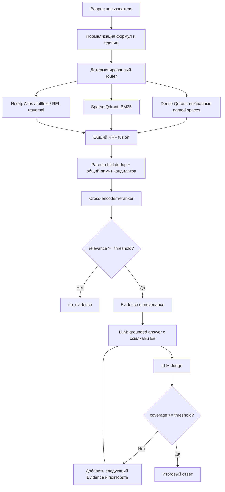

# Подробное описание системы Metallurgy RAG

## 1. Назначение системы

`metallurgy_rag` — система поиска и формирования ответов по технической
литературе в области металлургии. Она отвечает на вопросы о процессах,
реакциях, составе шлаков и штейнов, температурах, режимах плавки,
оборудовании, формулах, величинах и таблицах.

Главная цель — не просто сгенерировать правдоподобный ответ, а найти в
корпусе подтверждающие фрагменты и показать, из какого документа и страницы
они пришли. Поэтому система разделяет две задачи:

1. **Retrieval** — найти и отранжировать материал корпуса.
2. **Generation** — сформулировать ответ только по прошедшему проверку
   материалу и поставить ссылки `[E1]`, `[E2]`, … на использованные evidence.

Если поиск не нашёл релевантных источников, штатный режим не вызывает LLM для
ответа «из общих знаний». Вместо этого он возвращает `no_evidence`. Пользователь
может отдельно запросить LLM-only ответ, но тогда UI явно помечает его как
неподтверждённый корпусом.

## 2. Предметная область

Корпус состоит из литературы по чёрной и цветной металлургии: пирометаллургии,
обогащению, плавке, восстановлению оксидов, химии расплавов, производству
меди, никеля и других металлов. Особенность такой литературы — один факт может
жить в разных представлениях:

- в обычном абзаце: «рост температуры способствует восстановлению…»;
- в химической реакции: `FeS + 3Fe3O4 + 5SiO2 → 5Fe2SiO4 + SO2`;
- в математической формуле с номером уравнения;
- в ячейке таблицы с единицей измерения;
- в графовом утверждении «сущность — отношение — сущность».

Поэтому одного поиска по абзацам недостаточно. Система хранит и ищет текст,
формулы, таблицы, величины и связи между понятиями раздельно, но приводит их к
единому контракту `Evidence` перед генерацией ответа.

## 3. Данные и их жизненный цикл

Исходный материал — PDF и результаты их разбора. MinerU извлекает блоки текста,
формулы и HTML-таблицы; подготовительный конвейер удаляет служебный шум,
дубликаты и неинформативные блоки. Нормализованный корпус находится в
`corpus_split/`.

```text
PDF-литература
    │
    ├── MinerU / parsing
    │       └── blocks: текст, формулы, таблицы, страницы, метаданные
    │
    ├── prepare
    │       └── corpus_split/
    │            ├── text/
    │            ├── formulas_chem/
    │            ├── formulas_math/
    │            ├── tables/
    │            ├── all/              объединённые JSONL
    │            └── manifest.json     состав и статистика
    │
    ├── Qdrant indexer
    │       └── SearchUnit + sparse BM25 + named dense vectors
    │
    └── KG pipeline
            └── Neo4j: Term, Alias, Statement, Sentence, Document, REL
```

В текущем `corpus_split` указано 284 нормализованных документа. Граф Neo4j,
восстановленный из `kg_rag/dump/neo4j.dump`, является отдельным представлением
данных: в проверенном дампе было 290 `Document`, 333 244 `Sentence`, 67 663
`Term`, 554 919 `Statement`, 67 093 `Alias` и 159 842 связей `REL`. Эти числа
могут отличаться от Qdrant-корпуса: граф и плоский индекс могли быть построены
из разных срезов литературы. При сравнении методов это означает, что измеряется
не только алгоритм поиска, но и покрытие соответствующего хранилища.

## 4. Плоский индекс Qdrant

### 4.1. SearchUnit и parent-child модель

После подготовки один исходный фрагмент текста становится родительским
`chunk`. Из него выделяются более точные дочерние единицы:

```text
chunk                         родительский контекст абзаца
├── formula                   химическая либо математическая формула
├── table_row                 строка таблицы
├── table_cell                конкретная ячейка таблицы
└── quantity                  число вместе с единицей измерения
```

У дочерней единицы есть `parent_chunk_id`, поэтому система может найти точную
формулу или ячейку, а LLM показать окружающий абзац, а не короткий обрывок.
Это называется small-to-big retrieval: маленький объект обеспечивает точность
нахождения, большой — достаточный контекст для объяснения.

Каждый `SearchUnit` несёт:

- устойчивый `unit_id`, тип и `parent_chunk_id`;
- исходный текст, документ и страницы;
- `text_search` для лексического поиска;
- metadata: язык, год, авторы, категория, тип документа, элементы;
- структурные поля формул, таблиц и величин;
- один named dense vector по типу объекта.

Структурные поля особенно важны. Например, для найденной ячейки известны
`table_id`, `row_label`, `column_header`, `cell_value`; для формулы —
`formula_latex`, `formula_flat`, `equation_number`, `formula_class`; для
величины — `value`, `unit_raw`, `unit_canonical`, `si_value`, `dimension`.

### 4.2. Dense embeddings

В Qdrant нет одного общего embedding для всего корпуса. Используются named
spaces:

| Тип единицы | Векторное пространство | Что оно ищет |
| --- | --- | --- |
| `chunk` | `dense_text` | смысл обычного текста |
| химическая формула/реакция | `dense_chemistry` | химические сущности и процессы |
| математическая/физическая формула | `dense_math` | формулы, уравнения, параметры |
| строки и ячейки таблиц | `dense_table` | составы, режимы, табличные значения |
| число с единицей | `dense_unit` | величины и размерности |

В build CLI для каждого пространства можно задать отдельную embedding-модель.
Это позволяет, например, отдельно улучшать химию, не меняя хранение таблиц.
Однако текущая существующая коллекция `metallurgy_search_units` создана
768-мерной моделью `intfloat/multilingual-e5-base`. Поэтому runtime API
зафиксирован переменной:

```bash
RAG_DENSE_MODEL=intfloat/multilingual-e5-base
```

Это принципиально: `BAAI/bge-m3` создаёт 1024-мерные вектора и не может
искать в уже построенной 768-мерной коллекции. Переключение модели требует
создания новой коллекции или полного `--recreate` индекса, а не простой смены
настройки поиска.

Для E5 применяются обучающие префиксы: `query: ` для вопроса и `passage: ` для
документа. Вектор нормализуется, поэтому скалярное произведение равно cosine
similarity. Эти embeddings отвечают на смысловой вопрос: «какие фрагменты
близки по содержанию, даже если слова отличаются?».

### 4.3. Лексический канал «BM25»

В коде канал называется `bm25`. Токенизатор выделяет доменные токены, включая
формулы, числа и единицы. `SparseVocab` выдаёт каждому токену стабильный ID и
формирует sparse-вектор с частотами терминов. Qdrant хранит sparse-вектор
`bm25` с modifier `IDF`: редкие термины получают больший вес.

Этот канал особенно полезен, когда запрос содержит точную строку, которую
нельзя терять при семантическом обобщении: `Fe3O4`, `SO2`, номер уравнения,
`1200 °C`, марку сплава, сокращение процесса или заголовок столбца таблицы.
Файл `data/qdrant_vocab.json` нужно переносить вместе с Qdrant-коллекцией:
без него ID sparse-терминов после перезапуска не будут совпадать с индексом.

## 5. Граф знаний Neo4j

### 5.1. Что хранит граф

Граф нужен не как замена Qdrant, а как другое представление фактов. Основные
узлы: `Term`, `Alias`, `Statement`, `Sentence`, `Document`. Связи связывают
алиасы с терминами, термины друг с другом (`REL`), утверждения с субъектом и
объектом, утверждения с предложениями, а предложения с документами.

Пример логики:

```text
Alias «магнетит» ──MEANS──> Term Fe3O4
Term «температура» ──REL: способствует──> Term «восстановление магнетита»
Statement ──SAID_IN──> Sentence ──FROM──> Document
```

Благодаря этому граф может вернуть не просто похожий абзац, а путь между
понятиями и предложение, подтверждающее связь.

### 5.2. Графовый retrieval в текущей системе

В режиме `graph` вопрос сначала лемматизируется. Далее Neo4j ищет seed-термины
двумя лексическими способами:

1. точное совпадение через `Alias.form → MEANS → Term`;
2. полнотекстовый индекс `term_search`.

От найденных терминов система обходит связи `REL`, выбирает короткие пути и
соседей, затем извлекает связанные `Statement → Sentence → Document`. Каждый
результат превращается в `Evidence` с ID вида `kg:<statement uid>`, страницей,
документом и `structured.graph`, содержащим путь и список связей.

Режим `graph` намеренно не использует векторный индекс вершин `term_vec` из
исходного `kg_rag`. Это делает эксперимент «только граф» действительно
графово-лексическим: он измеряет пользу алиасов, отношений и обхода связей,
а не одновременно dense поиска по вершинам. В production можно добавить
четвёртый режим «graph + vector seeds», где dense поиск предлагает начальные
термины, а Neo4j расширяет контекст. Его сейчас в UI нет; включение `vector`
и `graph` означает Qdrant dense retrieval плюс отдельный графовый retrieval,
а не vector index `term_vec` внутри Neo4j.

## 6. Прохождение пользовательского вопроса



### 6.1. Нормализация и router

Перед поиском `normalize_query` приводит формулоподобные записи к общей форме:
например, `H_{2}O`, `Н2О` и `H2O` становятся сопоставимыми; `\tau` становится
`τ`. Обычные русские и английские слова нормализатор не переписывает.

Затем router детерминированно выбирает dense-каналы:

- химические формулы, названия оксидов, шлака, штейна, реакций → `chemistry`;
- слова «формула», «уравнение», символы и математические конструкции → `math`;
- слова «таблица», «состав», «строка», «столбец» → `table`;
- единицы и числовые условия → `unit`;
- `text` добавляется как общий объясняющий канал.

Если вопрос задаёт простое условие «выше 1200 °C» или «не более …», router
формирует Qdrant range-filter по `si_value` и `unit_canonical`. Сложные единицы
не сводятся к одному SI-значению автоматически: для них остаётся текстовый и
векторный поиск без рискованного range-фильтра.

Пользователь выбирает любой непустой набор верхнеуровневых методов:

- `vector` — dense каналы, выбранные router;
- `bm25` — sparse лексический поиск;
- `graph` — Neo4j traversal.

Например, `vector + bm25 + graph` запускает все три источника кандидатов;
`graph` запускает только Neo4j; `bm25` не загружает embedding-модель.

### 6.2. RRF — объединение рангов

Каждый включённый канал возвращает собственный отсортированный список. Их
оценки несопоставимы напрямую: cosine similarity, sparse score и graph score
имеют разные шкалы. Поэтому используется Reciprocal Rank Fusion:

```text
RRF(document) = Σ 1 / (60 + rank_канала)
```

Вклад зависит от позиции, а не от абсолютного raw score. Один и тот же объект,
найденный несколькими каналами, получает сумму вкладов и сохраняет
`retrieval_channels`, то есть происхождение результата.

После fusion Qdrant children группируются по `parent_chunk_id`: для одного
абзаца остаётся лучший child. Затем общий пул ограничивается максимумом из
`candidates` и `4 × k` (обычно до 40), чтобы комбинация из трёх методов не
получала несправедливое преимущество просто из-за большего числа кандидатов.

Графовые ID отличаются от Qdrant ID, поэтому автоматической дедупликации
одинакового текста между двумя хранилищами сейчас нет. Reranker и финальные
citations всё равно сохраняют происхождение каждого источника.

### 6.3. Cross-encoder reranker и порог релевантности

RRF говорит: «этот объект высоко находится в нескольких списках». Но он не
доказывает, что объект отвечает на вопрос. Для этого второй этап оценивает пару
`(вопрос, кандидат + контекст)` cross-encoder-моделью
`BAAI/bge-reranker-v2-m3`.

Она возвращает logit, который преобразуется sigmoid в число от 0 до 1:

```text
relevance_score = 1 / (1 + exp(-logit))
```

Фрагмент передаётся генератору только при
`relevance_score >= RAG_RELEVANCE_THRESHOLD`; текущий порог по умолчанию 0.55.
Так нерелевантные top-K результаты не превращаются в ложный RAG-контекст.
Порог необходимо калибровать на размеченной выборке: его повышение уменьшает
ложные совпадения, но увеличивает вероятность `no_evidence`.

Reranker загружается лениво и ограничен `RAG_RERANKER_MAX_LENGTH` (1024 токена)
и `RAG_RERANKER_BATCH_SIZE` (4), чтобы длинные фрагменты не исчерпали память.
Если cross-encoder недоступен, используется строгий лексический fallback по
пересечению доменных токенов; в `QueryProfile.reranker` это фиксируется как
`lexical-fallback`.

## 7. Grounded generation

После relevance gate создаётся компактный контекст. Для каждого Evidence в него
входят номер `[E#]`, документ, страницы, структурные поля и текст. Ограничения
по умолчанию: до 2200 символов на фрагмент и до 12 000 символов на весь
контекст. Это удерживает prompt в разумном объёме и сохраняет связь факта со
ссылкой.

Системная инструкция генератору требует:

- отвечать по-русски;
- опираться только на переданные Evidence;
- ставить `[E#]` после каждого факта из корпуса;
- не выдумывать непокрытые детали;
- использовать точные structured-поля для формул, номеров и значений.

Поддерживаются два типа генератора:

- локальный Ollama, по умолчанию `qwen3:8b`;
- любой OpenAI-compatible endpoint: vLLM, SGLang, LM Studio, MetalGPT server,
  OpenRouter и т. п.

Генератор не участвует в поисковом индексе. Его замена не требует
переиндексации Qdrant или Neo4j.

## 8. LLM Judge

### 8.1. Зачем нужен Judge

Reranker проверяет полезность каждого **фрагмента** для вопроса. Judge проверяет
другое: закрывает ли уже сгенерированный **ответ** вопрос по существу. Это два
разных уровня качества.

Judge получает вопрос, черновой ответ и контекст Evidence. Его инструкция
просит вернуть строго JSON:

```json
{"coverage": 0.0, "missing": "какая часть вопроса не покрыта"}
```

`coverage` находится в диапазоне 0…1. Если модель нарушила JSON-формат,
парсер пытается извлечь JSON, затем отдельное число или процент; при полной
неудаче ставит 0.0. Judge оценивает покрытие фактического содержания, а не
красоту языка и не является автоматическим доказательством истинности ответа.

### 8.2. Итеративная схема

При наличии N evidence генерация начинается с top-1:

```text
top-1 Evidence → answer₁ → Judge → coverage₁
             │
             └─ если coverage ниже порога:
                top-1 + top-2 → answer₂ → Judge → coverage₂
                                  │
                                  └─ … до max_iterations
```

По умолчанию порог `RAG_JUDGE_THRESHOLD = 0.82`, максимум
`RAG_JUDGE_MAX_ITERATIONS = 3`. Если порог достигнут, результат получает режим
`hybrid`. Если доказательства есть, но за разрешённые итерации покрытие не
достигнуто, выбирается лучшая попытка с режимом `hybrid_partial`. В результате
сохраняются `judge_score`, `judge_missing`, `judge_model`, `iterations` и
`evidence_used`.

Judge может быть той же моделью, что генератор, либо независимой более сильной
моделью. Для второго случая используются `RAG_JUDGE_PROVIDER`,
`RAG_JUDGE_MODEL`, `RAG_JUDGE_BASE_URL`, `RAG_JUDGE_API_KEY` и
`RAG_JUDGE_TIMEOUT`. Например, локальный Qwen или MetalGPT может писать ответ,
а внешний сильный модельный endpoint — только проверять покрытие.

В текущем проекте API читает общий корневой `.env`. Если там определены
`OPENROUTER_API_KEY` и `OPENROUTER_MODEL`, они автоматически настраивают
независимого Judge через `https://openrouter.ai/api/v1`. При этом модель
генератора не меняется: Qwen/MetalGPT по-прежнему формирует ответ, а
OpenRouter-модель проверяет coverage. Переменные `RAG_JUDGE_*` имеют приоритет
и позволяют выбрать другой Judge без изменения базовой OpenRouter-конфигурации.

В Streamlit UI поле `LLM Judge model` позволяет изменить только model slug для
одного запроса. Ключ не передаётся в браузер: API использует серверный ключ из
`kg_rag/.env`. Пустое поле означает «использовать модель из конфигурации API».

Важно: Judge повышает контроль, но не заменяет экспертную оценку. Сильная LLM
может ошибочно завысить coverage, особенно если вопрос требует знания вне
переданных evidence. Надёжная оценка качества требует отдельной разметки:
вопрос → релевантные страницы/фрагменты → ожидаемые факты или эталонный ответ.

## 9. Режимы результата и трассируемость

| Режим | Значение |
| --- | --- |
| `hybrid` | Evidence найдено, ответ сформирован по нему, Judge достиг порога |
| `hybrid_partial` | Evidence есть, но Judge не достиг порога за число итераций |
| `no_evidence` | Ни один кандидат не прошёл relevance threshold; LLM не вызывалась |
| `llm_only` | Явно запрошенный ответ без доказательств из корпуса |

Каждый возвращаемый Evidence хранит `unit_id`, `unit_type`, `document_id`,
`pages`, `text`, `context`, RRF score, `relevance_score`, участвовавшие каналы
и structured-поля. UI раскрывает этот список в «Источники RAG». Поэтому можно
проверить не только финальный текст, но и путь: какой метод нашёл объект,
почему он прошёл reranker и использовался ли он в citations.

## 10. Эксперименты и корректное сравнение методов

`python -m pdfscan.rag.experiments` запускает на одном наборе вопросов один
или все семь непустых сочетаний `vector`, `bm25`, `graph`:

```text
vector
bm25
graph
vector + bm25
vector + graph
bm25 + graph
vector + bm25 + graph
```

В режиме `--retrieval-only` измеряются retrieval и reranking без расходов на
генератор и Judge. В полном режиме JSONL также содержит ответ и judge score.
Для каждого варианта сохраняются метод, конфигурация, profile, Evidence,
время, ошибки и summary со средним числом кандидатов/принятых источников и
долей запросов с evidence.

Эти метрики являются диагностикой, а не precision/recall. Например, большая
доля evidence не доказывает, что они правильные. Для честного сравнения нужно:

1. зафиксировать один набор вопросов;
2. размечать релевантные документы/страницы или факты;
3. считать Recall@k, Precision@k, MRR/nDCG для retrieval;
4. отдельно оценивать groundedness, полноту и корректность ответов экспертом;
5. фиксировать версии корпуса, Qdrant collection, Neo4j dump, embedding и
   reranker-моделей.

Первый запрос после запуска может быть намного медленнее остальных: он
загружает embedding-модель и reranker. Его нельзя напрямую сравнивать с
последующими запросами как latency конкретного метода.

## 11. Компоненты запуска

```text
Browser → Streamlit UI :8501 → FastAPI :8000
                                  │
                    ┌─────────────┼─────────────┐
                    │             │             │
             Qdrant :6333   Neo4j :7687    LLM endpoint
              flat index      graph        Ollama / vLLM /
                                              SGLang / API
```

Docker Compose запускает Qdrant, одноразовый `neo4j-restore`, Neo4j, API и UI.
`neo4j-restore` загружает dump только в пустой named volume
`metallurgy_rag_neo4jdata`; существующую графовую базу не перезаписывает.
Ollama специально остаётся на хосте, а не в Linux-контейнере Docker Desktop:
на macOS это сохраняет доступ к Metal. API обращается к ней по
`host.docker.internal:11434`.

## 12. Практические ограничения и следующие улучшения

1. Графовый и Qdrant корпуса могут отличаться. Нужен manifest версий и
   сопоставление `Document` между базами.
2. Между `kg:<statement uid>` и Qdrant `unit_id` нет общей дедупликации.
   Полезное улучшение — сопоставлять `sentence_uid`/документ/страницу или
   хеш нормализованного текста.
3. Графовый режим пока использует только лексические seeds. Отдельный режим
   `graph + vector seeds` стоит добавить и оценить после базовых ablation.
4. Пороги 0.55 для reranker и 0.82 для Judge — стартовые настройки. Их нельзя
   считать универсальными без калибровки на экспертной выборке.
5. LLM Judge оценивает coverage, не фактологическую истинность. Для строгой
   проверки нужна экспертная разметка и проверка цитат.
6. Текущий Qdrant индекс привязан к 768-мерному E5. Любая смена embedding
   модели требует отдельной версии коллекции, чтобы не смешивать пространства.
7. MetalGPT-1 — 33B BF16 модель; её запуск без достаточной памяти или GPU не
   является заменой обычного локального Qwen. Рациональная схема — выделенный
   GPU endpoint для MetalGPT и/или сильная внешняя Judge-модель.

## 13. Где смотреть реализацию

| Часть | Файл |
| --- | --- |
| Создание Qdrant и hybrid search | `src/pdfscan/rag/qdrant_index.py` |
| Router, fusion, dedup, Evidence | `src/pdfscan/rag/retrieval.py` |
| Neo4j adapter | `src/pdfscan/rag/graph.py`, `graph_core.py` |
| Reranker | `src/pdfscan/rag/rerank.py` |
| Grounded generation | `src/pdfscan/rag/answering.py` |
| Judge | `src/pdfscan/rag/judge.py` |
| LLM providers | `src/pdfscan/rag/llm.py` |
| FastAPI | `src/pdfscan/web/api.py` |
| Streamlit UI | `src/pdfscan/web/app.py` |
| Эксперименты | `src/pdfscan/rag/experiments.py` |
| Runtime services | `docker-compose.yml` |
