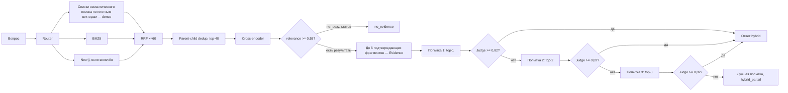

# Исправления описания поиска, RRF, генерации и LLM Judge

## 1. Термины для презентации

### Семантический поиск по плотным векторам (dense retrieval)

Семантический поиск по плотным векторам (dense retrieval) преобразует вопрос
и поисковые объекты в числовые векторы фиксированной длины. Текущая модель
`intfloat/multilingual-e5-base` создаёт векторы размерности 768. Qdrant
сравнивает вектор вопроса с векторами корпуса по косинусной близости.

Такой поиск находит фрагменты, близкие по смыслу, даже если вопрос и документ
используют разные формулировки. В системе применяются пять отдельных
векторных пространств:

- `dense_text` — обычный текст;
- `dense_chemistry` — химические формулы и реакции;
- `dense_math` — математические и физические формулы;
- `dense_table` — строки и ячейки таблиц;
- `dense_unit` — величины и единицы измерения.

Векторы разных пространств не складываются, не усредняются и не
конкатенируются. Каждое выбранное пространство возвращает собственный
ранжированный список. После этого списки объединяются методом RRF.

### Подтверждающий фрагмент (Evidence)

Подтверждающий фрагмент (Evidence) — поисковый объект, который прошёл
объединение списков, дедупликацию, повторное ранжирование cross-encoder и порог
релевантности. Только такие объекты разрешено передавать генератору ответа.

Подтверждающий фрагмент содержит:

- `unit_id` и тип объекта;
- точный найденный текст;
- родительский контекст;
- `document_id` и страницы;
- каналы, в которых объект найден;
- RRF score;
- итоговый `relevance_score` cross-encoder;
- структурные поля формулы, таблицы или величины.

Один подтверждающий фрагмент не равен одному документу. Несколько фрагментов
могут относиться к одному документу и одной странице. Поэтому в описании цикла
следует писать «до трёх подтверждающих фрагментов (Evidence)», а не «до трёх
источников».

## 2. Фактическое ранжирование в текущей реализации

### Этап 1. Получение отдельных списков

Детерминированный маршрутизатор выбирает специализированные векторные
пространства. Пространство `dense_text` добавляется всегда. В зависимости от
запроса дополнительно включаются `dense_chemistry`, `dense_math`,
`dense_table` или `dense_unit`.

Каждое активное векторное пространство формирует отдельный список до 40
кандидатов. BM25 формирует ещё один список. Neo4j формирует отдельный список,
если пользователь включил графовый поиск.

### Этап 2. Reciprocal Rank Fusion

Списки объединяются методом Reciprocal Rank Fusion. В текущем коде параметр
`k_RRF` равен 60, а веса всех отдельных списков равны единице.

Формула:

\[
\operatorname{RRF}(d)=
\sum_{c \in C_d}
\frac{w_c}{k_{RRF}+r_c(d)}
\]

где:

- `d` — кандидат;
- `C_d` — множество списков, в которых найден кандидат;
- `r_c(d)` — позиция кандидата `d` в списке `c`, начиная с 1;
- `w_c` — вес списка, сейчас `w_c = 1`;
- `k_RRF = 60`.

Для текущей конфигурации:

\[
\operatorname{RRF}(d)=
\sum_{c \in C_d}
\frac{1}{60+r_c(d)}
\]

Пример. Если один объект занял 2-е место в `dense_text`, 5-е место в BM25 и
не найден другими каналами, его оценка равна:

\[
\operatorname{RRF}(d)=
\frac{1}{60+2}+\frac{1}{60+5}
=0{,}01613+0{,}01538
=0{,}03151
\]

RRF использует позиции, а не исходные значения cosine similarity, BM25 score
или graph score. Эти исходные оценки имеют разные шкалы и напрямую не
складываются.

Важно: равны веса отдельных списков, а не трёх укрупнённых методов. Например,
запрос может породить три списка семантического поиска по плотным векторам
(dense), один BM25-список и один graph-список. Поэтому семейство семантического
поиска по плотным векторам (dense) может внести несколько слагаемых в RRF.

### Этап 3. Parent-child дедупликация

После RRF результаты группируются по `parent_chunk_id`. Для одного
родительского фрагмента остаётся дочерний объект с максимальной RRF score.
После дедупликации сохраняется не более 40 кандидатов.

Ограничение текущей схемы: дедупликация выполняется до cross-encoder. Поэтому
может быть удалён другой дочерний объект того же родителя, который получил
меньший RRF, но лучше отвечает на конкретный вопрос.

### Этап 4. Повторное ранжирование cross-encoder

Модель `BAAI/bge-reranker-v2-m3` оценивает пары
«вопрос + кандидат с родительским контекстом». Logit преобразуется сигмоидой:

\[
\operatorname{relevance}(q,d)=
\sigma(z)=\frac{1}{1+e^{-z}}
\]

После этого кандидаты сортируются заново только по `relevance_score`.
Следовательно:

- RRF формирует предварительный пул;
- cross-encoder определяет окончательный порядок;
- RRF score остаётся диагностическим полем и не складывается с
  `relevance_score`.

Кандидаты с `relevance_score < 0,55` удаляются. Из оставшихся возвращается
итоговый top-k: по умолчанию до 6 подтверждающих фрагментов для контура ответа
и до 8 для retrieval CLI.

### Этап 5. Отказ при отсутствии данных

Если каналы не вернули кандидатов либо ни один кандидат не прошёл порог 0,55,
система возвращает `no_evidence`. Генератор ответа не вызывается.

## 3. Текущий цикл генерации и LLM Judge

### Шаг 1. Retrieval

Для HTTP API значение `evidence_k` по умолчанию равно 6. Retrieval может
вернуть до шести подтверждающих фрагментов после cross-encoder.

### Шаг 2. Первая генерация

Текущая реализация начинает не со всех найденных фрагментов, а только с
первого:

```text
top-1 подтверждающий фрагмент (Evidence) → генератор → ответ 1 → LLM Judge
```

Генератор получает системную инструкцию отвечать только по переданным
фрагментам и ставить ссылки `[E1]`, `[E2]` и так далее.

### Шаг 3. Оценка полноты

LLM Judge получает:

- вопрос пользователя;
- сгенерированный ответ;
- тот же контекст подтверждающих фрагментов.

Judge возвращает JSON:

```json
{"coverage": 0.0, "missing": "какая часть вопроса не покрыта"}
```

Порог полноты по умолчанию равен 0,82. Judge оценивает полноту ответа, но не
доказывает истинность каждого утверждения.

### Шаг 4. Расширение контекста

Если `coverage < 0,82`, код добавляет следующий фрагмент из уже готового
рейтинга и полностью генерирует ответ заново:

```text
попытка 1: top-1 → ответ 1 → Judge
попытка 2: top-2 → ответ 2 → Judge
попытка 3: top-3 → ответ 3 → Judge
```

Цикл ограничен параметром `RAG_JUDGE_MAX_ITERATIONS`, значение по умолчанию —
3. Поэтому при стандартной конфигурации генератор использует максимум три
подтверждающих фрагмента, хотя retrieval мог вернуть шесть.

Поле `missing` сейчас сохраняется для диагностики, но не запускает новый поиск
и не определяет, какой фрагмент добавить. Код просто берёт следующий объект из
существующего рейтинга.

### Шаг 5. Завершение

- Если coverage достиг 0,82, текущий ответ возвращается в режиме `hybrid`.
- Если три попытки исчерпаны, возвращается попытка с максимальным coverage в
  режиме `hybrid_partial`.
- Если подтверждающих фрагментов нет, возвращается `no_evidence`.
- LLM-only режим допускается только по явному запросу пользователя.

## 4. Почему могло казаться, что источников больше

До появления текущего цикла LLM Judge предыдущая реализация передавала
генератору сразу весь список найденных подтверждающих фрагментов, обычно до
шести. После введения Judge код изменили на последовательное расширение
`top-1`, `top-2`, `top-3`.

Поэтому утверждение «раньше использовалось больше фрагментов» верно для
предыдущей реализации. В текущей реализации число найденных и число фактически
переданных генератору фрагментов различаются:

```text
retrieval: до 6 подтверждающих фрагментов (Evidence)
генератор при стандартных настройках: до 3 подтверждающих фрагментов (Evidence)
```

## 5. Исправления для презентации

### Слайд «Элементы подсистемы»

Заменить `Dense Retrieval` на:

> Семантический поиск по плотным векторам (dense retrieval)

Добавить:

> Вопрос и объекты корпуса преобразуются в векторы. Текущая модель E5 создаёт
> векторы размерности 768. Каждое специализированное пространство формирует
> отдельный список кандидатов.

### Слайд «Ранжирование результатов»

Использовать формулировку:

> RRF объединяет позиции кандидата в отдельных списках:
> `RRF(d) = Σ 1 / (60 + rank_c(d))`. RRF формирует предварительный пул.
> Cross-encoder повторно оценивает пары «вопрос + фрагмент» и определяет
> окончательный порядок результатов.

Не следует писать, что окончательный результат ранжируется только по RRF.

### Слайд «Генерация и проверка ответа»

Заменить `Evidence` на:

> Подтверждающий фрагмент (Evidence)

Заменить фразу «генератор использует от одного до трёх источников» на:

> В текущей реализации retrieval возвращает до шести подтверждающих
> фрагментов, но стандартный цикл из трёх попыток передаёт генератору
> последовательно top-1, top-2 и top-3.

Добавить:

> Judge не выполняет повторный поиск. Поле `missing` не выбирает следующий
> фрагмент. Контекст расширяется следующим объектом существующего рейтинга.

### Слайд «Экспериментальная оценка»

Заменить `dense` на:

> семантический поиск по плотным векторам (dense)

Заменить `Evidence` на:

> подтверждающий фрагмент (Evidence)

## 6. Рекомендуемый вариант цикла

Если требуется сохранить три вызова Judge и при этом использовать все шесть
отобранных фрагментов, рекомендуется кумулятивная схема:

```text
попытка 1: top-2 → генератор → Judge
попытка 2: top-4 → генератор → Judge
попытка 3: top-6 → генератор → Judge
```

Такой вариант лучше согласуется с параметром `evidence_k=6`, но пока не
реализован. Презентация должна описывать либо фактическую схему `1–2–3`, либо
код необходимо изменить на `2–4–6`.

## 7. Итоговая схема текущей реализации



## 8. Проверенные файлы реализации

- `src/pdfscan/rag/retrieval.py` — RRF, дедупликация и cross-encoder ranking;
- `src/pdfscan/rag/answering.py` — последовательность top-1, top-2, top-3;
- `src/pdfscan/rag/judge.py` — prompt и формат ответа Judge;
- `src/pdfscan/web/api.py` — `evidence_k=6` и параметры Judge;
- `src/pdfscan/web/app.py` — пользовательский выбор числа подтверждающих
  фрагментов (Evidence);
- `tests/test_answering.py` — тесты кумулятивного расширения контекста.
