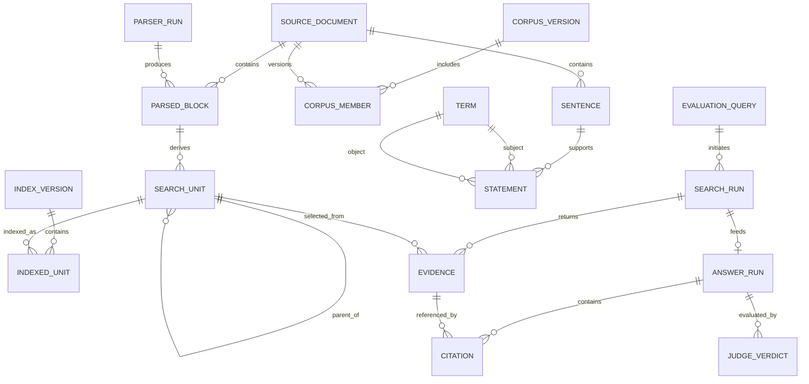

# Ответы на замечания к презентации «Гибридная RAG-система»

## 1. Статус документа и принцип ответа

Документ подготовлен по замечаниям к слайдам 2–17 презентации «Гибридная
RAG-система» и по результатам проверки полного описания архитектуры в
`docs/SYSTEM_DESCRIPTION.md`, конфигурации и исходного кода проекта.

Чтобы не смешивать фактическое состояние прототипа с планируемыми работами,
ниже используются три статуса:

- **реализовано** — поведение подтверждается текущим кодом или артефактами
  проекта;
- **зафиксировано как проектное решение** — параметр принят для архитектуры и
  должен быть внесён в конфигурацию, схемы или регламент;
- **требует эксперимента** — значение нельзя считать доказанным до получения
  разметки и результатов измерений.

Главный итог проверки: подробное описание корректно передаёт реализованный
поисковый и генеративный конвейер, но не закрывает все требования системного
анализа. В частности, число «40%» в презентации является **целевым**, а не
полученным результатом. Строгие IDEF0/DFD-диаграммы, логическая ER-модель,
формализованный реестр рисков, IAA, анализ мощности и сквозное версионирование
артефактов пока отсутствуют. Эти замечания принимаются.

## 2. Проверенные исходные параметры системы

Перед ответами по слайдам фиксируются параметры, которые уже можно подтвердить
по репозиторию.

### 2.1. Корпус

В `corpus_split/manifest.json` указаны:

- 284 нормализованных документа;
- 206 233 текстовых блока из 283 документов;
- 4 976 химических формул и реакций из 162 документов;
- 9 281 математическая или физическая формула из 177 документов;
- 7 861 таблица из 252 документов;
- 70 917 отброшенных служебных блоков и 9 700 пустых блоков.

Графовый дамп описан отдельным срезом данных: 290 `Document`, 333 244
`Sentence`, 67 663 `Term`, 554 919 `Statement`, 67 093 `Alias` и 159 842
отношения `REL`. Различие 284 и 290 документов означает, что Qdrant и Neo4j
могут представлять неодинаковые версии корпуса. Это не следует скрывать:
сравнение каналов без выравнивания корпусов частично измеряет различие данных,
а не только алгоритмов.

### 2.2. Поиск и ранжирование

- Доступные верхнеуровневые методы: `vector`, `bm25`, `graph`.
- По умолчанию используются `vector + bm25`; граф включается явно.
- Dense-модель существующей коллекции: `intfloat/multilingual-e5-base`, размер
  вектора 768.
- В коде существует общий build-time default `BAAI/bge-m3`, но текущий индекс
  с ним несовместим по размерности. Переход на BGE-M3 требует новой коллекции и
  полной переиндексации.
- Имеются пять named vector spaces: `dense_text`, `dense_chemistry`,
  `dense_math`, `dense_table`, `dense_unit`. Их вектора не конкатенируются.
  Каждый канал формирует отдельный ранжированный список, списки объединяются
  общим RRF.
- Параметр RRF: `k = 60`; формула вклада канала:

  `RRF(d) = sum(1 / (60 + rank_channel(d)))`.

- По умолчанию каждый активный список возвращает до 40 кандидатов.
- После RRF и parent-child dedup пул ограничивается
  `max(candidates, 4 × k)`, при типовых настройках — 40 объектами.
- Итоговый retrieval возвращает до 8 Evidence, а контур генерации запрашивает
  до 6 Evidence. Фактически генератор использует от одного до трёх Evidence,
  потому что контекст расширяется по одному источнику за итерацию Judge.
- Cross-encoder: `BAAI/bge-reranker-v2-m3`; максимум 1 024 токена на пару,
  batch size 4.
- Порог релевантности по умолчанию: `0,55`. Это стартовое, а не
  откалиброванное значение.

### 2.3. Фрагментация и граф

- Parent-chunk имеет жёсткий предел 650 токенов, ориентиры 180–400 токенов.
- Для прозы используется overlap двух предложений, дополнительно ограниченный
  15% бюджета parent-chunk.
- Child-объекты не имеют единого размера: это атомарная формула, строка
  таблицы, ячейка таблицы или величина с единицей измерения.
- Графовый поиск использует до 12 seed-терминов, лексические `Alias` и
  полнотекстовый индекс `term_search`.
- Глубина обхода по умолчанию — 1 отношение; лимит путей — 40;
  из одного отношения извлекается до трёх подтверждающих `Statement`.

### 2.4. Генерация и Judge

- Генератор по умолчанию: локальный `qwen3:8b` через Ollama.
- Judge может использовать ту же модель либо отдельную OpenAI-compatible
  модель. В примере конфигурации OpenRouter указан
  `qwen/qwen3.6-35b-a3b`; это конфигурация развертывания, а не обязательная
  часть метода.
- Порог Judge coverage: `0,82`; максимум итераций — 3.
- Контекст ограничивается 2 200 символами на Evidence и 12 000 символами на
  запрос.
- Формат ссылки в ответе: `[E1]`, `[E2]`, ...; соответствующий Evidence хранит
  `document_id`, страницы и устойчивый `unit_id`.
- Judge оценивает полноту покрытия вопроса. Он **не реализует независимую
  проверку истинности каждого утверждения**.
- Если ни один кандидат не прошёл relevance threshold, система возвращает
  `no_evidence` и не вызывает генератор. Если лимит итераций исчерпан, ответ
  маркируется `hybrid_partial`.

## 3. Ответы по слайдам

## 3.1. Слайд 2. Постановка проблемы

### Замечание: не указаны стейкхолдеры

Замечание принимается. Для системы выделяются следующие стейкхолдеры:

1. **Инженер-металлург / технолог** — основной пользователь; формулирует
   вопрос, проверяет источник и принимает технологическое решение. Система не
   должна подменять его профессиональную ответственность.
2. **Исследователь или преподаватель** — использует систему для поиска
   взаимосвязей, формул, таблиц и первичных источников.
3. **Эксперт-разметчик** — создаёт эталонные ответы, отмечает релевантные
   документы и классифицирует утверждения как подтверждённые,
   противоречащие источнику либо не подтверждённые.
4. **Владелец корпуса / библиотекарь данных** — отвечает за лицензии,
   происхождение, состав, актуальность и версии документов.
5. **ML/NLP-инженер** — отвечает за retrieval, reranking, LLM, Judge,
   экспериментальную оценку и воспроизводимость.
6. **Администратор инфраструктуры** — сопровождает Qdrant, Neo4j, LLM endpoint,
   резервные копии, доступ и мониторинг.
7. **Руководитель проекта / заказчик** — принимает критерии качества, бюджет и
   остаточный риск.
8. **Специалист по информационной безопасности и правам на данные** —
   контролирует лицензии на литературу, утечки через внешние API и журналы.

### Замечание: нет количественной оценки проблемы

Часть количественного контекста уже известна: корпус содержит 284 документа и
сотни тысяч разнородных блоков. Это подтверждает масштаб задачи поиска, но не
измеряет ущерб от текущего процесса. Для полноценной постановки проблемы
необходимо дополнительно измерить:

- медианное и 95-й перцентиль времени ручного поиска ответа;
- долю вопросов, для которых эксперт находит источник за заданное время;
- число документов и страниц, открытых до нахождения ответа;
- долю неподтверждённых утверждений у baseline LLM;
- долю ответов с неверной страницей или неверной интерпретацией таблицы;
- стоимость одного запроса в человеко-минутах и вычислительных ресурсах.

До проведения такого замера нельзя утверждать численное сокращение времени
поиска или числа ошибок. В презентации нужно разделить «масштаб корпуса» и
«измеренный эффект системы».

### Замечание: нет корневых причин

Корневая причина формулируется так: **предметные знания распределены между
разными представлениями и документами, а традиционный полнотекстовый поиск и
LLM без привязки к корпусу не обеспечивают одновременно семантический поиск,
точное нахождение формул/чисел и проверяемое происхождение ответа**.

Её составляющие:

- гетерогенность данных: проза, формулы, химические реакции, таблицы, величины;
- языковая вариативность и синонимия на русском и английском языках;
- ошибки OCR, потеря индексов, единиц и структуры таблиц;
- несопоставимость score разных каналов поиска;
- ограниченное контекстное окно LLM;
- отсутствие источника у ответа baseline LLM;
- рассинхронизация плоского и графового представлений корпуса.

### Замечание: не указан объём корпуса

В слайд следует добавить подтверждённые значения из раздела 2.1. Основное
значение — 284 документа в нормализованном Qdrant-корпусе. Число 290 относится
к отдельному Neo4j-срезу и должно показываться отдельно, а не как альтернативная
оценка одного и того же корпуса.

### Замечание: непонятно, как измеряется «снижение галлюцинаций на 40%»

Термин необходимо заменить операциональным показателем
**доля неподтверждённых атомарных утверждений** (`Unsupported Claim Rate`,
UCR). Эксперт разбивает ответ на проверяемые утверждения и присваивает каждому
один статус:

- `supported` — утверждение подтверждается процитированным источником;
- `contradicted` — источник ему противоречит;
- `not_found` — в источнике подтверждение отсутствует;
- `not_verifiable` — утверждение не имеет проверяемого фактического содержания.

Основная метрика:

`UCR = (N_contradicted + N_not_found) / N_verifiable_claims`.

Относительное снижение:

`Reduction = (UCR_baseline - UCR_RAG) / UCR_baseline × 100%`.

SMART-цель выполнена, если относительное снижение не менее 40%, а нижняя
граница 95%-го доверительного интервала для разности `UCR_baseline - UCR_RAG`
положительна. Если baseline имеет UCR 0,25, то целевой UCR RAG должен быть не
выше 0,15. Это пример вычисления, а не полученный результат.

## 3.2. Слайд 3. Дерево проблем

### Корень дерева и связи

Корень дерева следует сформулировать как «высокие затраты на поиск и
недостаточная проверяемость ответов по металлургической литературе».

Причинная структура:

1. Разнородность и низкое качество исходных данных
   → ошибки извлечения текста, формул, таблиц и единиц
   → неполный или искажённый индекс.
2. Один способ поиска не покрывает все типы знания
   → пропуск точных обозначений либо семантически близких фрагментов
   → низкий recall retrieval.
3. Некалиброванное объединение результатов
   → нерелевантный контекст
   → ошибки или неподтверждённые детали в ответе.
4. Генерация без контроля источников
   → утверждения без доказательств
   → риск неверного инженерного решения.
5. Отсутствие версионирования и эталонной оценки
   → результаты нельзя повторить или корректно сравнить
   → невозможно доказать достижение SMART-цели.

Количественные индикаторы для узлов: OCR character/formula error rate,
Recall@k, nDCG@k, UCR, citation precision/recall, latency, стоимость запроса и
доля воспроизводимых запусков. Стейкхолдеры привязываются к узлам через роли,
описанные в разделе 3.1.

## 3.3. Слайд 4. Дерево целей

### SMART-метрики и горизонт

Для прототипа предлагаются следующие **критерии приёмки**, которые ещё
требуют экспериментального подтверждения:

- до 20.12.2026 сформировать версионированный корпус и воспроизводимый индекс;
- Recall@10 retrieval не ниже 0,85;
- MRR@10 не ниже 0,70 и nDCG@10 не ниже 0,75;
- citation precision не ниже 0,95;
- доля проверяемых утверждений, покрытых корректными ссылками, не ниже 0,90;
- относительное снижение UCR относительно LLM без RAG не менее 40%;
- доля корректных `no_evidence` на негативных вопросах не ниже 0,90;
- полное воспроизведение эксперимента по manifest и команде запуска без ручной
  подмены параметров.

Значения являются проектными порогами. Они не должны подаваться как уже
достигнутые.

### Обратная связь и контур V&V

Дерево целей должно быть циклическим:

`эксперимент → анализ ошибок → изменение парсинга/router/порогов → новая версия
индекса → повторная оценка на неизменном holdout`.

Верификация отвечает на вопрос «система реализована согласно спецификации»:
тесты контрактов, схем, индексации, RRF, дедупликации, отказных режимов и
воспроизводимости. Валидация отвечает на вопрос «система решает задачу
эксперта»: экспертная оценка retrieval и ответов на отложенной выборке.

## 3.4. Слайд 5. Задачи

Перечень задач необходимо расширить:

7. Провести анализ альтернатив по взвешенным критериям.
8. Создать логическую модель данных и формальные контракты интерфейсов.
9. Ввести версионирование корпуса, индексов, моделей, промптов и результатов.
10. Обеспечить воспроизводимый эксперимент: lock-файлы, seed, manifest,
    конфигурация среды и команды запуска.
11. Выполнить анализ рисков, безопасности, лицензий и этических ограничений.
12. Реализовать мониторинг качества данных, retrieval, генерации, latency и
    стоимости.
13. Реализовать визуализацию пути Evidence: канал → ранг → reranker → citation.
14. Провести калибровку порогов и анализ статистической мощности.

## 3.5. Слайд 6. Общая схема системы

### Статус нотации

Замечание верно: показанная схема является компонентной архитектурной схемой,
а не строгой IDEF0 или DFD. В презентации её следует так и назвать. Если
требуется IDEF0, верхнеуровневая функция A0 описывается следующим образом:

- **Input:** PDF/сканы, метаданные документов, вопрос пользователя, настройки
  выбранных каналов;
- **Control:** схема `SearchUnit`/`Evidence`, правила очистки и router,
  конфигурация моделей, RRF `k`, relevance threshold, Judge threshold,
  политика цитирования, права доступа и критерии качества;
- **Output:** версионированные индексы, ранжированный Evidence, ответ со
  ссылками, `no_evidence`/`hybrid_partial`, журналы и метрики;
- **Mechanism:** MinerU или parser/OCR, Python-конвейер, Qdrant, Neo4j,
  cross-encoder, LLM, Judge, FastAPI, Streamlit и эксперт.

### Форматы хранения

- Исходные документы: PDF.
- Разбор MinerU: `*_content_list_v2.json`, fallback —
  `*_content_list.json`.
- Нормализованный корпус: JSONL по категориям плюс `manifest.json`.
- Qdrant: одна коллекция `metallurgy_search_units`, sparse-вектор `bm25`, пять
  named dense-векторов и JSON payload.
- Neo4j: labeled property graph с узлами `Term`, `Alias`, `Statement`,
  `Sentence`, `Document`; поставка — Neo4j dump.
- Эксперимент: JSONL с конфигурацией, профилем запроса, Evidence, ответом,
  Judge score, временем и ошибками.

### Метрики проверки качества

На схеме необходимо разделить четыре группы: качество подготовки данных,
retrieval, ответа и эксплуатации. Конкретные показатели приведены в разделах
3.15–3.16 и 5.

## 3.6. Слайд 7. Декомпозиция системы

### Интерфейсы подсистем

1. **Подготовка → хранение:** нормализованный `SearchUnit` с `unit_id`,
   `unit_type`, `parent_chunk_id`, `text`, `text_search`, `doc_id`, `pages`,
   metadata, structured fields и `vector_kind`.
2. **Хранение → retrieval:** отдельные ranked lists. Каждый hit содержит
   payload, raw score, имя канала и ранг.
3. **Retrieval → генерация:** `Evidence` с текстом, parent context,
   provenance, RRF score, relevance score, каналами и structured fields.
4. **Генерация → Judge:** вопрос, черновой ответ и тот же Evidence context.
5. **Backend → UI:** режим результата, ответ, citations, Evidence, параметры
   поиска, Judge score, число итераций и диагностические ошибки.

### Отдельные контуры

- **V&V:** unit/integration tests → regression dataset → экспертный holdout →
  отчёт сравнения → решение о выпуске.
- **Версионирование:** source manifest → corpus version → Qdrant collection
  version и Neo4j dump version → model/prompt/config version → run ID.
- **Мониторинг:** ingestion metrics, retrieval drift, empty-result rate,
  relevance distribution, Judge distribution, citation errors, latency, GPU/CPU
  и стоимость.
- **Обратная связь:** экспертная ошибка сохраняется с `query_id`, `run_id`,
  `unit_id` и типом дефекта; исправление создаёт новую версию, но не меняет
  результаты старого запуска.

## 3.7. Слайд 8. Методы подготовки знаний

### Параметры MinerU

Текущий репозиторий содержит адаптер результата MinerU, но не фиксирует версию
MinerU, backend и полную команду, которой был получен исходный разбор. Поэтому
замечание принимается. В manifest необходимо записывать:

- версию MinerU и commit/container digest;
- backend и режим определения OCR;
- языки;
- включение распознавания формул и таблиц;
- DPI и параметры layout/table recognition;
- имя исходного PDF, SHA-256 и время обработки;
- путь и SHA-256 `content_list_v2.json`.

Альтернативная ветка на `unstructured` в текущем коде использует
`strategy="hi_res"`, `infer_table_structure=True`,
`include_page_breaks=True` и автоматически определённые языки. Её параметры
также должны фиксироваться в manifest.

### Размер parent/child

Parent: максимум 650 токенов, целевой диапазон 180–400, overlap два
предложения. Child — не фиксированное текстовое окно, а законченный объект:
формула, строка/ячейка таблицы или величина. Для child следует хранить число
символов и токенов как наблюдаемую статистику, но искусственно дополнять его до
фиксированного размера нельзя.

### Порог OCR

Для общего OCR числовой confidence threshold не зафиксирован. Для повторного
OCR формул применяется структурный gate:

- модель `PP-FormulaNet_plus-L`;
- render DPI 300, padding 6 pt;
- минимальный crop 12 px, максимальный 2 400 px;
- минимальная площадь области 350 pt²;
- минимальная сторона 6 pt;
- максимальная высота области 160 pt;
- максимальная длина кандидата 600 символов;
- спорные замены по умолчанию не применяются (`accept_unsure=False`).

`model_score` сохраняется, но решение не основано на едином confidence
threshold. Следовательно, в презентации корректнее говорить не «порог OCR», а
«правила отбора и принятия OCR-кандидата». Для калибровки нужен размеченный
набор формул и метрики exact match/normalized edit distance отдельно по
индексам, греческим символам, знакам и числам.

### Версионирование и происхождение

Каждый объект должен наследовать цепочку:

`source_pdf_sha256 → parser_run_id → normalized_block_id → corpus_version →
index_version → search_run_id`.

Сейчас provenance до документа/страницы и `unit_id` реализован, но полной
сквозной версии корпуса и индекса нет.

## 3.8. Слайд 9. Подсистема 1: гибридный поиск

### Формат входа

Минимальный контракт:

```json
{
  "query": "При какой температуре восстанавливается Fe3O4?",
  "methods": ["vector", "bm25", "graph"],
  "k": 6,
  "relevance_threshold": 0.55,
  "filters": {}
}
```

### Формат выхода

```json
{
  "profile": {
    "vector_kinds": ["chemistry", "unit", "text"],
    "channels": ["chemistry", "unit", "text", "bm25", "graph"],
    "candidate_count": 40,
    "accepted_count": 3
  },
  "evidence": [{
    "unit_id": "...",
    "unit_type": "formula",
    "parent_chunk_id": "...",
    "document_id": "...",
    "pages": [42],
    "score": 0.0484,
    "relevance_score": 0.87,
    "retrieval_channels": ["dense_chemistry", "bm25"],
    "structured": {"formula_latex": "..."}
  }]
}
```

### Top-k, threshold, дедупликация и конфликты

- до 40 кандидатов от каждого активного канала;
- общий RRF `k=60`, равные веса;
- дедупликация Qdrant children по `parent_chunk_id`, остаётся child с лучшим
  RRF score;
- не более 40 объектов перед reranker;
- relevance threshold 0,55;
- до 6 Evidence для контура ответа или до 8 для retrieval CLI.

Между Qdrant и Neo4j общей текстовой дедупликации пока нет. Конфликт рангов
разрешается RRF и cross-encoder. Содержательное противоречие двух источников
автоматически не разрешается: оба Evidence должны сохранять provenance, а
ответ обязан указать расхождение. Для production нужен отдельный модуль
claim-level contradiction detection.

## 3.9. Слайд 10. Элементы подсистемы

### Dense-модель и размерность

Текущая коллекция: `intfloat/multilingual-e5-base`, 768 измерений. BGE-M3
имеет 1 024 измерения и требует нового индекса.

### Метод и глубина графового обхода

Seed-термины находятся точным `Alias.form → MEANS → Term` и полнотекстовым
`term_search`. Затем выполняется неориентированный обход `REL` между
seed-терминами и соседями. Глубина по умолчанию 1; пути сортируются по числу
seed-терминов, штрафу за общие word-узлы и длине пути. После этого выбираются
связанные `Statement → Sentence → Document`.

### Объединение пяти dense-пространств

Вектора не усредняются и не склеиваются. Router выбирает подмножество
пространств, каждый named vector формирует независимый ranked list, затем все
списки участвуют в одном RRF. Это устраняет необходимость сравнивать cosine
scores разных пространств напрямую.

### Мультиязычность

- E5 — мультиязычная embedding-модель;
- русские и английские запросы проходят общую нормализацию формул и единиц;
- химические кириллические омографы приводятся к канонической форме;
- BM25 сохраняет точные доменные токены;
- текущий regression dataset содержит 99 запросов: 56 английских, 43 русских,
  включая 10 cross-lingual запросов.

Наличие мультиязычной модели не доказывает равенство качества. Метрики следует
публиковать отдельно для `ru`, `en` и cross-lingual подмножеств.

### Обработка длинных документов

Длинный PDF не передаётся в LLM целиком. На offline-этапе он разбивается по
структурным атомам и секциям на parent-chunks до 650 токенов; формулы и таблицы
сохраняются как отдельные child-объекты со ссылкой на parent. На online-этапе
поиск выполняется по всему индексу, а в prompt попадают только прошедшие
reranker Evidence: до 2 200 символов на источник и до 12 000 символов суммарно.
Для аудита сохраняются документ и страницы, поэтому усечение prompt не должно
приводить к потере происхождения. Отдельно следует тестировать вопросы,
требующие сведения из удалённых друг от друга разделов одного документа.

## 3.10. Слайд 11. Выбор каналов поиска

### Основной и вспомогательные каналы

В текущей архитектуре нет постоянного «главного» канала: это осознанно, потому
что разные запросы требуют разных представлений. `dense_text` всегда
добавляется router как общий семантический канал; chemistry/math/table/unit
добавляются по признакам запроса; BM25 и graph включаются настройками метода.

Если для документации требуется эксплуатационный профиль, следует определить:

- базовый режим: `vector + bm25`;
- расширенный режим: `vector + bm25 + graph`;
- ablation-режимы: отдельные каналы и все непустые комбинации.

### Веса и метод объединения

Сейчас веса всех списков равны; fusion — RRF с `k=60`. Отсутствие весов не
является пропуском реализации, но должно быть явно указано. Взвешенный RRF
можно вводить только после настройки на validation set, не на holdout.

### Почему не выполнена «простая замена E5 на BGE-M3»

Причина не только в выборе качества: E5 совместима с существующим 768-мерным
индексом, а BGE-M3 создаёт 1 024-мерные вектора. Корректное сравнение требует
параллельной коллекции, одинакового корпуса, одних запросов и измерения
Recall/nDCG, latency, памяти и времени индексации. До такого эксперимента
нельзя утверждать, что BGE-M3 лучше для данного корпуса.

## 3.11. Слайд 12. Ранжирование результатов

Ответы на параметры:

- RRF `k=60`;
- parent: максимум 650 токенов, ориентир 180–400;
- child: атомарный объект переменного размера;
- relevance threshold: 0,55 по sigmoid от logit cross-encoder;
- лучший child родителя — объект с максимальным RRF score до reranking;
- если все каналы пусты либо ни один кандидат не прошёл порог —
  `no_evidence`, LLM не вызывается.

Нужно отметить ограничение: выбор одного child до cross-encoder может удалить
другой child того же parent, который лучше соответствует запросу. Улучшение —
оставлять несколько child на parent до reranker, а дедуплицировать после него.

## 3.12. Слайд 13. Выбор методов отбора

### Правила router

- химическая формула или слова «оксид», «шлак», «штейн», «реакция» →
  `chemistry`;
- слова «формула», «уравнение», математические символы → `math`;
- «таблица», «состав», «строка», `table`, `composition` → `table`;
- распознанное число с единицей → `unit`;
- `text` добавляется всегда;
- сравнительные конструкции «выше/ниже/не более» создают range-filter для
  простых нормализуемых единиц.

Если специализированный тип не распознан, остаётся `text`; при включённом BM25
лексический канал также продолжает работать. Таким образом, неопределённость
router не приводит к пустому набору каналов.

### Параметры и стоимость

- RRF `k=60`;
- cross-encoder threshold 0,55;
- до 40 кандидатов на reranking;
- cross-encoder обрабатывает до 1 024 токенов на пару batch size 4.

Для локальных моделей денежная цена запроса условно равна нулю, но должна
учитываться вычислительная стоимость. Для удалённого LLM:

`Cost = sum(input_tokens_i × price_in + output_tokens_i × price_out)`.

В худшем штатном случае выполняются три генерации и три вызова Judge. Retrieval
может включать до пяти dense-запросов, один sparse-запрос, один графовый поиск
и reranking 40 пар. Latency и стоимость должны сохраняться по этапам.

## 3.13. Слайд 14. Схема гибридного поиска

На диаграмме необходимо подписать:

- `top-40` для каждого активного ranked list;
- `RRF k=60`;
- `top-40` после fusion и parent-child dedup;
- `relevance threshold=0,55`;
- финальный `top-6` для ответа (`top-8` в retrieval CLI);
- ветку `empty / below threshold → no_evidence → LLM not called`.

При включении нескольких dense spaces фактическое число списков больше трёх:
каждый named vector является отдельным списком, после чего BM25 и graph
добавляются в тот же fusion.

## 3.14. Слайд 15. Генерация и проверка ответа

### Модели и параметры

- генератор по умолчанию — `qwen3:8b`;
- Judge — та же модель либо отдельная модель из `RAG_JUDGE_*`/OpenRouter;
- максимум итераций — 3;
- coverage threshold — 0,82;
- ссылки — `[E#]`, разрешаемые в `unit_id`, документ и страницы.

### Невозможность сформировать ответ

- нет Evidence → `no_evidence`, генератор не вызывается;
- Evidence есть, но Judge не достиг 0,82 → выбирается попытка с максимальным
  coverage и возвращается `hybrid_partial`;
- недоступен генератор/Judge → запрос должен завершаться диагностической
  ошибкой, без подмены подтверждённого ответа общими знаниями;
- LLM-only допускается только как явный выбор пользователя и маркируется как
  неподтверждённый корпусом.

### Проверка фактов

Сейчас реализованы grounding prompt, citations, provenance, relevance gate и
coverage Judge. Это контроль источников и полноты, но не строгая проверка
фактов. Для claim-level fact verification необходимо:

1. разбить ответ на атомарные утверждения;
2. сопоставить каждому утверждению одну или несколько citations;
3. проверить entailment/contradiction относительно процитированного текста;
4. отдельно валидировать числа, единицы, формулы и табличные координаты;
5. отправлять спорные случаи эксперту;
6. считать citation precision, claim coverage и UCR.

## 3.15. Слайд 16. Методы контроля ответа

### Prompt Judge

Текущий системный prompt требует оценить долю вопроса, которую ответ закрывает
по существу, от 0 до 1, и вернуть строго JSON:

```json
{"coverage": 0.0, "missing": "что не покрыто"}
```

Judge получает вопрос, черновой ответ и Evidence context. Temperature — 0.
Парсер допускает fallback из неидеального JSON, но при полной ошибке ставит
coverage 0.

### IAA и размер выборки

Текущий набор из 99 запросов является инженерным regression dataset, а не
доказательством качества. Для итогового эксперимента предлагается:

- не менее 200 вопросов после пилота, стратифицированных по типу знания,
  языку и наличию/отсутствию ответа в корпусе;
- минимум два независимых эксперта на каждый ответ;
- третий эксперт или совместная сессия для adjudication;
- Cohen's kappa для двух разметчиков либо Krippendorff's alpha при пропусках и
  нескольких разметчиках;
- целевой IAA `alpha/kappa ≥ 0,80`; диапазон 0,67–0,80 допускает только
  предварительные выводы и требует анализа разногласий.

Окончательный объём необходимо подтвердить анализом мощности на пилоте, а не
выбирать только по удобству.

### Разногласия Judge и эксперта

Эксперт является источником эталона. Ошибки классифицируются как
Judge-overestimate, Judge-underestimate, citation error, retrieval miss,
generation error или ambiguity. Порог 0,82 калибруется на validation set по
отношению к экспертному решению; holdout не используется для настройки.

Калибровка confidence: reliability diagram, expected calibration error и
Brier score по бинарному событию «ответ принят экспертами». Само число
coverage нельзя автоматически считать вероятностью корректности.

## 3.16. Слайд 17. Экспериментальная оценка

### Baseline и сравниваемые варианты

Обязательные baseline:

1. LLM без RAG;
2. BM25;
3. dense-only;
4. graph-only;
5. `BM25 + dense`;
6. `BM25 + graph`;
7. `dense + graph`;
8. `BM25 + dense + graph`;
9. при наличии ресурсов — RAG без reranker и RAG без Judge как ablation.

Для всех вариантов фиксируются корпус, вопросы, доступный top-k и вычислительная
среда. LLM без RAG сравнивается по ответам, но не по retrieval-метрикам.

### Целевые значения

Проектные пороги приведены в разделе 3.3. Отдельно следует публиковать:

- Recall@5/10, Precision@5/10, MRR@10, nDCG@10;
- answer factual correctness и completeness;
- citation precision и claim coverage;
- UCR и относительное снижение UCR;
- `no_evidence` precision/recall;
- median/p95 latency, GPU/CPU memory и денежную стоимость запроса;
- результаты по типам `table`, `formula`, `chemistry`, `unit`, `prose`,
  `crosslingual`.

### Статистическая значимость и мощность

Сравнение должно быть парным по одним и тем же вопросам:

- paired bootstrap или randomization test для Recall/nDCG/MRR;
- cluster bootstrap по вопросам для claim-level UCR, чтобы несколько
  утверждений одного ответа не считались независимыми;
- McNemar test для парного бинарного успеха;
- 95%-е доверительные интервалы и effect size наряду с p-value;
- correction for multiple comparisons при сравнении многих конфигураций.

Мощность определяется после пилота по baseline UCR, дисперсии и числу
утверждений на ответ. Плановый минимум 200 вопросов должен быть увеличен, если
расчёт не даёт мощности не менее 0,8 для обнаружения целевого 40%-го
относительного снижения.

### Воспроизводимость

Каждый эксперимент должен сохранять:

- git commit;
- SHA-256 и версию корпуса;
- Qdrant collection/version и Neo4j dump hash;
- модели и их revisions/digests;
- prompts и их версии;
- все thresholds, top-k, RRF `k`, graph depth и seed;
- версии Python/библиотек, ОС и hardware;
- сырые результаты JSONL и агрегирующий script version;
- разделение train/validation/holdout и список `query_id`.

## 4. Логическая ER-модель

Физически система использует документные payload Qdrant и property graph
Neo4j. Поэтому ниже приведена логическая ER-модель, задающая сквозные сущности
и ключи независимо от конкретного хранилища.



Ключевые идентификаторы:

- `document_id` и `source_sha256` — документ и неизменяемая версия файла;
- `block_id` — блок конкретного parser run;
- `unit_id` — атомарная поисковая единица;
- `parent_chunk_id` — связь small-to-big;
- `corpus_version`, `index_version`, `model_revision`, `prompt_version`;
- `query_id`, `search_run_id`, `answer_run_id`;
- `statement_uid`/`sentence_uid` для графового Evidence.

Для устранения дубликатов между Qdrant и Neo4j необходим общий ключ
`document_id + page + normalized_text_hash` либо явное сопоставление
`sentence_uid ↔ unit_id`.

## 5. Матрица альтернатив

Оценка ниже является проектной и должна быть подтверждена экспериментом.
Шкала: 1 — хуже, 5 — лучше. Веса: качество поиска 0,30; работа со структурой
0,20; проверяемость 0,20; стоимость 0,15; сложность эксплуатации 0,15.

| Альтернатива | Качество | Структура | Проверяемость | Стоимость | Эксплуатация | Взвешенная оценка |
| --- | ---: | ---: | ---: | ---: | ---: | ---: |
| LLM без RAG | 2 | 1 | 1 | 4 | 5 | 2,35 |
| BM25 | 3 | 2 | 4 | 5 | 5 | 3,65 |
| Dense-only | 4 | 3 | 4 | 3 | 4 | 3,65 |
| Qdrant BM25 + dense | 4 | 4 | 4 | 3 | 4 | 3,85 |
| Qdrant + Neo4j + reranker | 5 | 5 | 5 | 2 | 2 | 4,10 |
| Fine-tuning без retrieval | 3 | 2 | 1 | 1 | 2 | 2,00 |

Гибридный вариант выигрывает по покрытию представлений и provenance, но имеет
большую сложность и стоимость. Поэтому его преимущество должно доказываться
ablation-экспериментом. Веса утверждаются заказчиком и экспертами до просмотра
итоговых результатов, иначе возникает риск подгонки решения.

## 6. Риски и допущения

| Риск | Вероятность | Влияние | Контроль |
| --- | --- | --- | --- |
| Ошибки OCR формул, чисел и единиц | высокая | высокое | структурный gate, выборочная ручная проверка, OCR benchmark |
| Разные версии Qdrant и Neo4j | высокая | высокое | единый corpus manifest, hash документов, блокировка выпуска при mismatch |
| Неверный или неполный Evidence | средняя | высокое | Recall@k, hard negatives, error analysis, no_evidence |
| Judge завышает coverage | средняя | высокое | экспертная калибровка, отдельный holdout, hybrid_partial |
| Противоречащие источники | средняя | высокое | показывать оба источника, дата/версия, expert escalation |
| Смена модели ломает размерность индекса | средняя | высокое | отдельная collection version, schema check до запуска |
| Утечка закрытых документов во внешний API | средняя | критическое | локальная LLM по умолчанию, redaction, allowlist провайдеров |
| Непредсказуемая стоимость внешней LLM | средняя | среднее | budget/rate limits, cache, токен-метрики, локальный fallback |
| Дрейф качества после обновления корпуса | высокая | среднее | regression suite и release gate на каждой версии |
| Использование ответа без проверки экспертом | средняя | критическое | явное предупреждение, citations, запрет автономного управления процессом |

Основные допущения:

- документы легально доступны для обработки;
- страницы и метаданные извлекаются с достаточной точностью;
- эталонная разметка создаётся компетентными металлургами;
- пользователь понимает, что RAG — справочная, а не управляющая система;
- инфраструктура позволяет хранить разные версии индексов;
- модели могут быть заменены только через контролируемый эксперимент.

## 7. Этические и правовые аспекты

1. **Ответственность.** Система не принимает технологические решения и не
   управляет оборудованием; окончательное решение принимает специалист.
2. **Прозрачность.** Режимы `no_evidence`, `hybrid_partial` и `llm_only`
   отображаются явно. Нельзя маскировать отсутствие подтверждения.
3. **Авторское право.** Необходимо хранить сведения о лицензии документа и
   ограничивать выдачу необходимыми фрагментами, а не воспроизводить книги.
4. **Конфиденциальность.** Закрытые документы и запросы не отправляются во
   внешнюю LLM без отдельного разрешения и политики обработки данных.
5. **Языковая справедливость.** Качество оценивается отдельно на русском,
   английском и cross-lingual запросах.
6. **Автоматизационное смещение.** Высокий Judge score не должен восприниматься
   как гарантия истинности; UI должен показывать исходный Evidence.
7. **Аудит.** Для каждого ответа сохраняются версии данных, моделей, prompts,
   параметры поиска и источник каждого утверждения.

## 8. Контур версионирования и мониторинга

### 8.1. Минимальная схема версии

```text
corpus_version = hash(source manifest + parser config + normalization code)
qdrant_version = corpus_version + embedding model revision + schema version
neo4j_version  = corpus_version + KG extraction version + dump hash
run_version    = qdrant_version + neo4j_version + retrieval config
                 + reranker revision + LLM revision + prompt version
```

В immutable run manifest должны находиться все эти поля. Изменение любого
компонента создаёт новый `run_version`; существующие результаты не
перезаписываются.

### 8.2. Мониторинг

- ingestion: число документов/блоков, доля OCR, ошибки parser, дубликаты;
- index: число units по типам, векторная размерность, пропуски metadata;
- retrieval: empty-result rate, Recall@k на canary set, распределение scores,
  вклад каналов и доля fallback reranker;
- generation: `no_evidence`, `hybrid_partial`, Judge coverage, citation rate;
- качество: экспертные дефекты по категориям, UCR, citation precision;
- эксплуатация: latency по этапам, timeout/error rate, CPU/GPU/RAM, токены и
  стоимость;
- drift: изменение распределения языков, типов запросов и документов.

Алерт должен указывать `run_version`, затронутую метрику и ссылку на примеры,
а не только сообщать о падении средней величины.

## 9. Какие формулировки презентации нужно исправить

1. «Снижение галлюцинаций на 40%» заменить на «целевое относительное снижение
   доли неподтверждённых атомарных утверждений не менее чем на 40%; результат
   будет проверен парным экспертным экспериментом».
2. Слайд 6 назвать «Компонентная схема», если строгая IDEF0/DFD отдельно не
   построена.
3. На всех слайдах различать параметры по умолчанию, откалиброванные параметры
   и целевые метрики.
4. Указать, что текущий Judge измеряет coverage, но не доказывает истинность.
5. Указать различие 284 документов Qdrant-корпуса и 290 документов графового
   дампа.
6. Не говорить о BGE-M3 как о простой замене E5: это отдельный индекс и
   эксперимент.
7. Добавить отказные ветки `no_evidence`, `hybrid_partial`, provider error и
   конфликт источников.
8. Добавить ER-модель, матрицу альтернатив, реестр рисков, V&V и
   версионирование отдельными слайдами или приложением.

## 10. Итоговая позиция по замечаниям

Большинство замечаний обоснованы как требования к полноте презентации и
системному анализу. При этом часть запрошенных деталей уже реализована, но не
была вынесена на слайды: E5 768, RRF `k=60`, лимит 40, relevance threshold
0,55, parent до 650 токенов, graph depth 1, `qwen3:8b`, Judge threshold 0,82,
три итерации и явный `no_evidence`.

Ключевое ограничение состоит не в отсутствии ещё одного параметра на схеме, а
в отсутствии завершённого экспертного эксперимента. До него нельзя считать
доказанными 40%-е снижение неподтверждённых утверждений, целевые значения
retrieval и качество Judge. Архитектура должна представлять эти значения как
гипотезы и критерии приёмки, а не как достигнутые результаты.

## 11. Источники проверки внутри проекта

- `docs/SYSTEM_DESCRIPTION.md` — полное описание текущей архитектуры;
- `corpus_split/manifest.json` — объём и состав нормализованного корпуса;
- `src/pdfscan/rag/retrieval.py` — router, RRF, дедупликация, лимиты и Evidence;
- `src/pdfscan/rag/qdrant_index.py` — Qdrant schema, named vectors и BM25;
- `src/pdfscan/rag/atoms.py` — параметры parent chunk и overlap;
- `src/pdfscan/rag/graph_core.py` — seed limits, глубина и графовый обход;
- `src/pdfscan/rag/rerank.py` — cross-encoder и relevance threshold;
- `src/pdfscan/rag/answering.py` — grounded prompt, citations и итерации;
- `src/pdfscan/rag/judge.py` — prompt и парсинг Judge coverage;
- `src/pdfscan/formulas/ocr/config.py` — параметры повторного OCR формул;
- `.env.example` — модели и runtime defaults;
- `datasets/eval_questions.jsonl` — текущие 99 regression-запросов.
